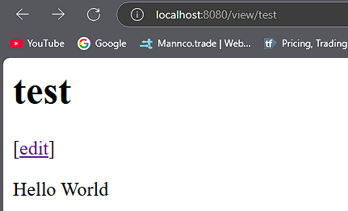

# Go-Web-App

Creating a simple webapp using Golang. The following are screenshots of the running program after each of the following chapters:
1. Introduction
2. Getting Started
3. Data Structures
4. Introducing the net/http package (an interlude)
5. Using net/http to serve wiki pages
6. Editing Pages
7. The html/template package
8. Handling non-existent pages
9. Saving Pages
10. Error handling
11. Template caching
12. Validation
13. Introducing Function Literals and Closures

 

## Introduction, Getting Started, and Data Structures Chapters
### Test Page

### Data Structures

 

## Introducing the net/http package (an interlude) Chapter
### Monkeys!

 

## Using net/http to serve wiki pages Chapter
### view/test page

 

## The html/template package Chapter
### view/test page updated

### edit/test page

 

## Chapter 8-13

